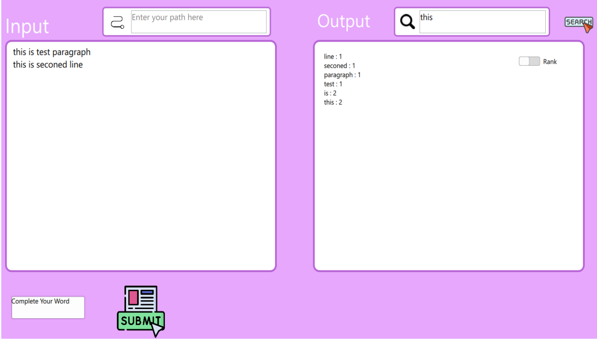

# Word Frequently Count

### Description

The Word Frequency Counter project aims to develop a utility that analyzes text input and provides insights into the frequency of each word occurring in the text. The project involves designing and implementing data structures to efficiently count word frequencies and provide functionalities to work in text. The project provides users with a simple interface to interact with the text data. Users can input text paragraphs or upload text files containing the text to be analyzed.Users can perform operations such as updating the text, deleting sentences or words, searching for specific words, and
displaying word frequencies and rankings.

 

### Backend
- **contains**: implementations of data structure and algorithms used in project
    - Binary search Tree
    - Trie

- **manages**: all component together to connect it with frontend
### Frontend
- the project frontend Based in **QML** 
- **QML (Qt Modeling Language) **is a powerful and expressive markup language designed for creating
user interfaces (UIs) in Qt applications
### How To Use the project

- **you will need to install**: cmake, QT, g++, gcc and development ide (like QT community)

- **Then build cmake and it will make all.**

#### Input Scenario:
1. Text Input: user can input English paragraphs directly into the system through a text input
interface.
2. File Upload: user can upload text files containing paragraphs for analysis by put path of this file

#### Output Scenario:
- it will display frequencies and ranks of words
- user can search for word
